# Set up VPC Peering Connections

To connect your application to TiDB Cloud, you need to set up [VPC peering](glossary.md#vpc-peering) with TiDB Cloud. It's one step of [Connect to Your TiDB Cluster](connect-to-tidb-cluster.md). This document walks you through setting up VPC peering connections on AWS or GCP.

VPC peering connection is a networking connection between two VPCs that enables you to route traffic between them using private IP addresses. Instances in either VPC can communicate with each other as if they are within the same network.

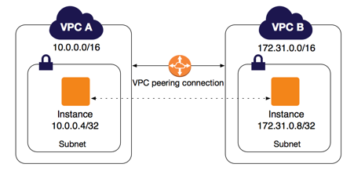

Currently, TiDB Cloud only supports VPC peering in the same region. TiDB clusters in the same region are created in a VPC with the `10.250.0.0/16` CIDR (Classless Inter-Domain Routing) block. So once a VPC peering is set up in the region, all the TiDB clusters created in this region can be connected in your VPC. VPC peering setup differs among cloud providers.

## On AWS

### Set up VPC peering connections

#### Add VPC peering requests

To make a VPC peering connection request, you could go to the 'Network Access' page. Click the 'Add' button.

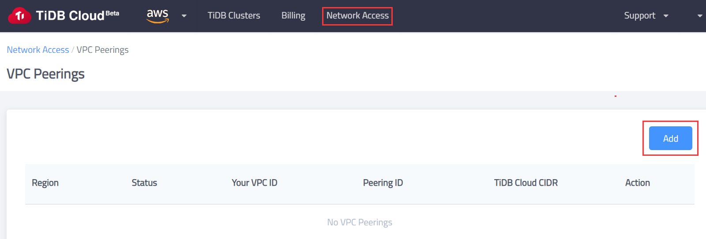

You could get the information from your VPC details on the VPC dashboard.


Fill the information into the blank of the 'Add' application form. Click the 'Initialize' button.

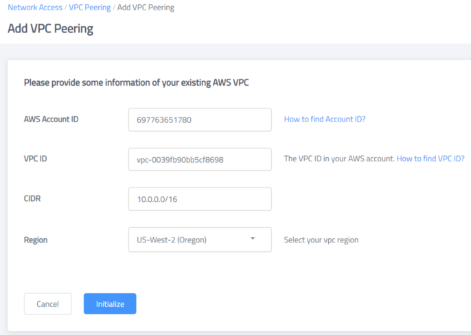

You will get the guidance like this.

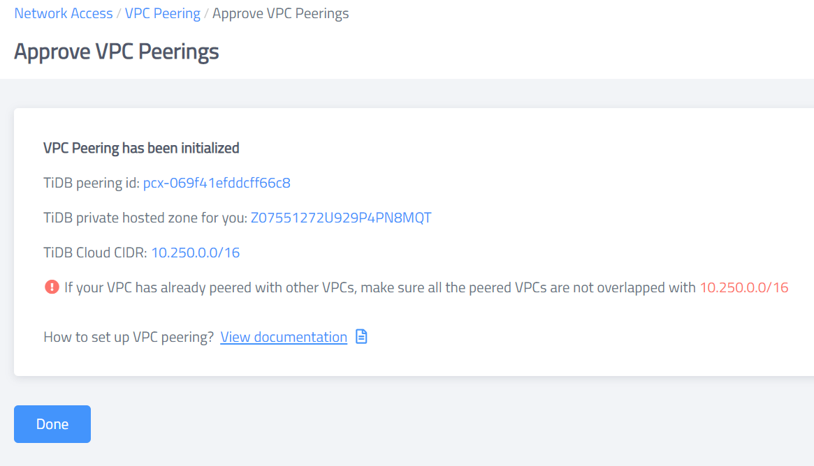

#### Approve and configure for VPC peering

Install awscli and configure awscli according to your account info. You could refert to AWS cli configure quickstart to know how to get the information the awscli need. [AWS User Guide: AWS Command Line Interface](https://docs.aws.amazon.com/cli/latest/userguide/cli-configure-quickstart.html)

```{.bash .copyable}
curl "https://awscli.amazonaws.com/awscli-exe-linux-x86_64.zip" -o "awscliv2.zip"
unzip awscliv2.zip
sudo ./aws/install
# Configure the awscli according to your account info
aws configure
```

Replace the contents included by '<>', execute these commands

```{.bash .copyable}
# Set up the related variables
pcx_tidb_to_app_id="<TiDB peering id>"
app_region="<APP Region>"
app_vpc_id="<Your VPC ID>"
tidb_phz_id="<TiDB private hosted zone for you>"
```

For example, in this guide, we use the information we get after we created the application.

```{.output}
# Set up the related variables
pcx_tidb_to_app_id="pcx-069f41efddcff66c8"
app_region="us-west-2"
app_vpc_id="vpc-0039fb90bb5cf8698"
tidb_phz_id="Z07551272U929P4PN8MQT"
```

After setting the variables, we execute the commands below.

```{.bash .copyable}
# accept VPC peering connection request
aws ec2 accept-vpc-peering-connection --vpc-peering-connection-id "$pcx_tidb_to_app_id"

# create route table roules
aws ec2 describe-route-tables --region "$app_region" --filters Name=vpc-id,Values="$app_vpc_id" --query 'RouteTables[*].RouteTableId' --output text|xargs -d "\t" -n 1|  while read row
do
    app_route_table_id="$row"
    aws ec2 create-route --route-table-id "$app_route_table_id" --destination-cidr-block 10.250.0.0/16 --vpc-peering-connection-id "$pcx_tidb_to_app_id"
done

# modify vpc attribute to enable DNS-hostname and DNS-support
aws ec2 modify-vpc-attribute --vpc-id "$app_vpc_id" --enable-dns-hostnames
aws ec2 modify-vpc-attribute --vpc-id "$app_vpc_id" --enable-dns-support
```

After finishing the configuration, the VPC peering has been created. We could connect to the TiDB cluster to verify the result.

#### Connect to the TiDB cluster on the TiDB Cloud

Navigate to the TiDB Cluster page. Click the 'Connect' Button

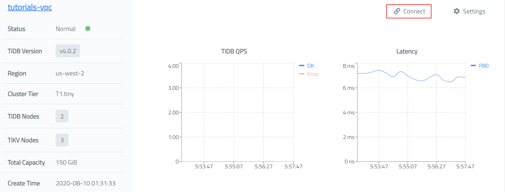

We could see the status of the VPC peering is activated. The connection information is shown below. We could access the TiDB Cluster from the instance within the VPC.

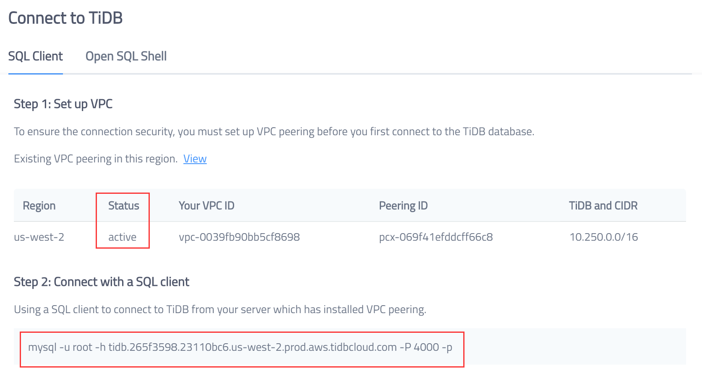

### (Options) Approve and configure the VPC on AWS dashboard

To explain what we have done in the shell scripts, we could follow the guide below to get familiar with the details.

#### 1. Confirm to accept the peer connection request in your AWS console.

##### 1.1 Sign in the AWS console and open the VPC service page


##### 1.2 Navigate the Peering Connections tab, you will see a peering connection in the 'Pending Acceptance' state, confirm the request owner is TiDB Cloud (380838443567) and accept the request

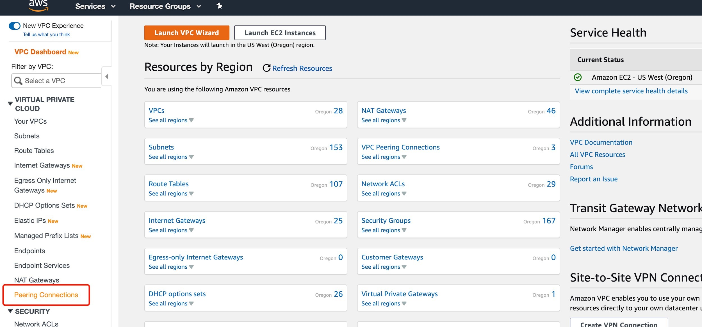


#### 2. Add a route to the TiDB Cloud VPC for each of your VPC subnet route tables

##### 2.1. Click Route tables, search all the route tables that belong to your application VPC

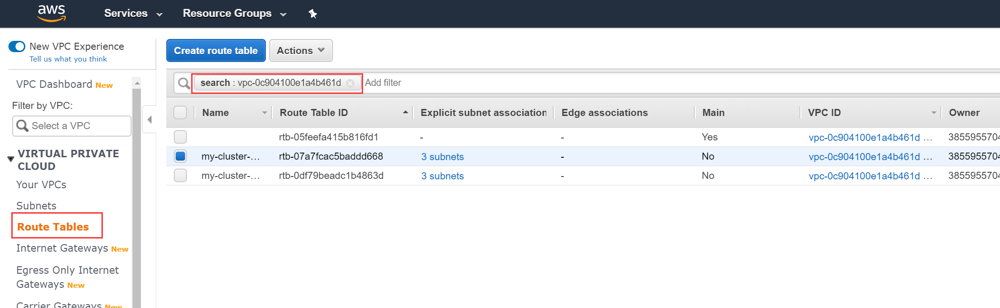

##### 2.2. Edit each route table to add a route with destination to the TiDB Cloud VPC CIDR (10.250.0.0/16) and peering connection id

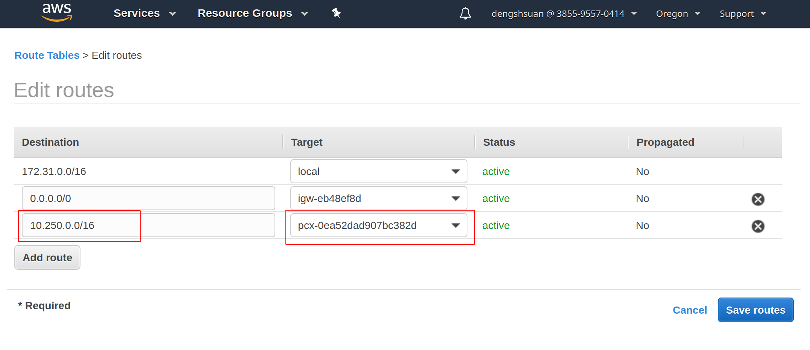

#### 3、Make sure you have enabled private DNS hosted zone support for your VPC.

##### 3.1. Select your application VPC

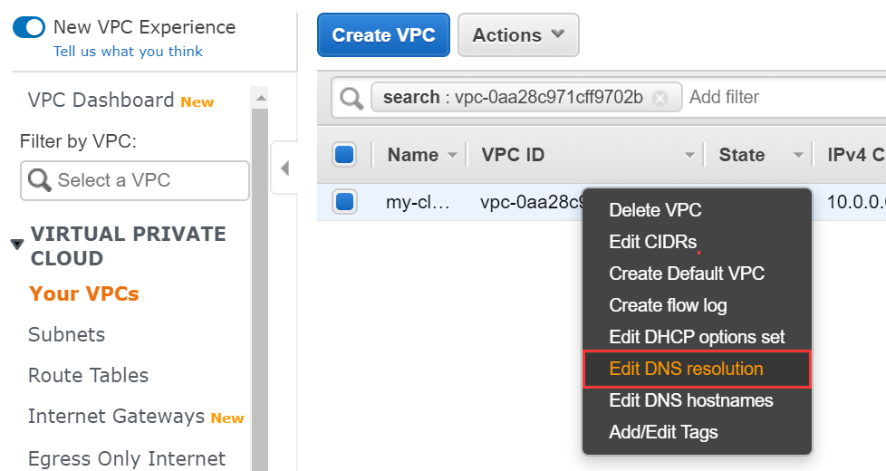

##### 3.2. Mouse over the selected VPC, right-click pops up the setting window

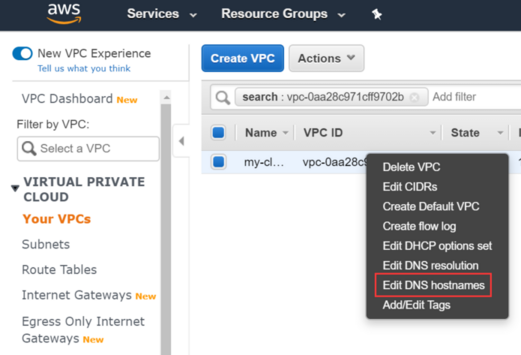

##### 3.3. Click the Edit DNS hostnames menu to enable DNS hostnames

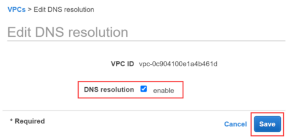

##### 3.4. Click Edit DNS resolution menu to enable DNS resolution

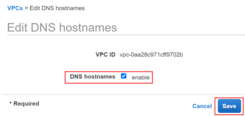

## On GCP

1. Visit the [TiDB Cloud support page](https://support.pingcap.com) and submit a request to provide the following information about your application GCP project:

    - Application GCP project ID: `<app-project-id>`
    - VPC network name: `<vpc-network-name>`

2. The TiDB Cloud support team will create a VPC peering for your VPC and provide the following information:

    - TiDB Cloud project ID: `<tidb-project-id>`
    - TiDB Cloud network name: `<tidb-network-name>`

3. Execute the following command to finish the VPC peering setup:

    ```{.bash copyable}
    gcloud beta compute networks peerings create <your -peer-name> --project <app-project-id> --network <vpc-network-name> --peer-project <tidb-project-id> --peer-network <tidb-network-name>
    ```

    > **Note:**
    >
    > You can name `<your-peer-name>` as you like.
